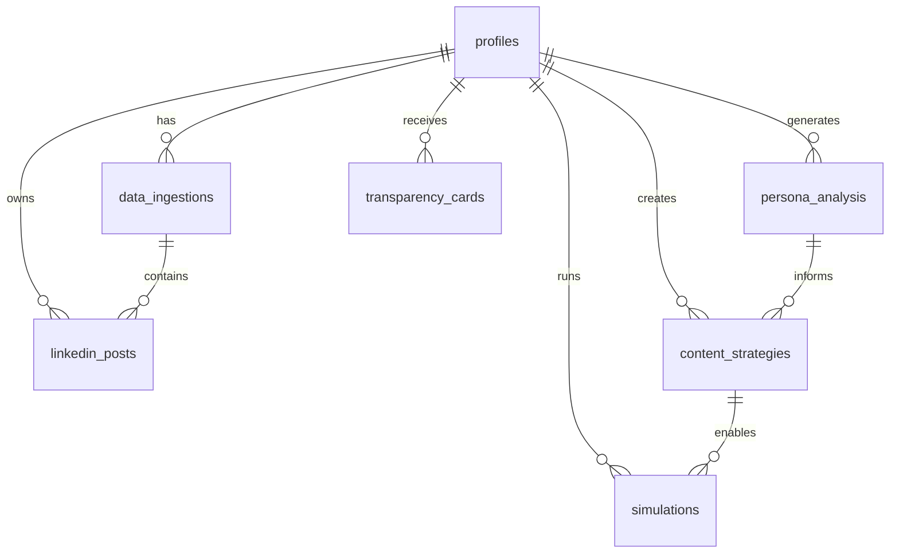

# Database Schema Documentation 📊

This document describes the complete database schema for MicroMe, including all tables, relationships, and data structures.

## 📝 Table of Contents

1. [Overview](#overview)
2. [Database Architecture](#database-architecture)
3. [Core Tables](#core-tables)
4. [Data Types & Conventions](#data-types--conventions)
5. [Relationships](#relationships)
6. [Indexes & Performance](#indexes--performance)
7. [Security & RLS](#security--rls)
8. [Migration History](#migration-history)

## Overview

MicroMe uses **PostgreSQL** via Supabase with the following key features:
- **Row Level Security (RLS)** for data protection
- **UUID primary keys** for scalability
- **JSONB columns** for flexible AI-generated data
- **Timestamp tracking** for audit trails
- **Foreign key constraints** for data integrity

### Database Statistics
- **Total Tables**: 7
- **Edge Functions**: 7
- **RLS Policies**: ~20+
- **Migrations**: 5

## Database Architecture



## Core Tables

### 1. `profiles` 👤

**Purpose**: User profile and account information

```sql
CREATE TABLE profiles (
    id UUID PRIMARY KEY DEFAULT auth.uid(),
    full_name TEXT,
    email TEXT,
    big_five_opt_in BOOLEAN DEFAULT true,
    use_external_links BOOLEAN DEFAULT true,
    suggest_tagging BOOLEAN DEFAULT true,
    created_at TIMESTAMP WITH TIME ZONE DEFAULT NOW(),
    updated_at TIMESTAMP WITH TIME ZONE DEFAULT NOW()
);
```

**Fields**:
- `id`: User ID (matches Supabase Auth UID)
- `full_name`: User's display name
- `email`: User's email address
- `big_five_opt_in`: Consent for personality analysis
- `use_external_links`: Allow external link suggestions
- `suggest_tagging`: Enable hashtag recommendations

**Indexes**:
- Primary key on `id`
- Index on `email` for lookups

---

### 2. `data_ingestions` 📊

**Purpose**: Tracks CSV uploads and data processing status

```sql
CREATE TABLE data_ingestions (
    id UUID PRIMARY KEY DEFAULT gen_random_uuid(),
    user_id UUID NOT NULL,
    upload_source TEXT CHECK (upload_source IN ('linkedin_api', 'csv_upload')),
    file_url TEXT,
    posts_count INTEGER DEFAULT 0,
    processing_status TEXT DEFAULT 'pending',
    error_message TEXT,
    created_at TIMESTAMP WITH TIME ZONE DEFAULT NOW(),
    updated_at TIMESTAMP WITH TIME ZONE DEFAULT NOW()
);
```

**Fields**:
- `id`: Unique ingestion identifier
- `user_id`: Reference to profile owner
- `upload_source`: Data source type (CSV upload or LinkedIn API)
- `file_url`: Storage URL of uploaded file
- `posts_count`: Number of posts processed
- `processing_status`: Current pipeline status
- `error_message`: Error details if processing failed

**Status Values**:
- `pending` - Awaiting processing
- `processing` - Currently being processed
- `completed` - Successfully processed
- `failed` - Processing failed

---

### 3. `linkedin_posts` 📝

**Purpose**: Stores processed LinkedIn post data and metrics

```sql
CREATE TABLE linkedin_posts (
    id UUID PRIMARY KEY DEFAULT gen_random_uuid(),
    user_id UUID NOT NULL,
    post_id TEXT,
    content TEXT NOT NULL,
    post_date TIMESTAMP WITH TIME ZONE,
    word_count INTEGER,
    emoji_count INTEGER,
    has_link BOOLEAN DEFAULT false,
    has_media BOOLEAN DEFAULT false,
    likes_count INTEGER DEFAULT 0,
    comments_count INTEGER DEFAULT 0,
    shares_count INTEGER DEFAULT 0,
    created_at TIMESTAMP WITH TIME ZONE DEFAULT NOW()
);
```

**Fields**:
- `id`: Unique post identifier
- `user_id`: Reference to post owner
- `post_id`: Original LinkedIn post ID (if available)
- `content`: Post text content
- `post_date`: When the post was originally published
- `word_count`: Number of words in post
- `emoji_count`: Number of emojis used
- `has_link`: Whether post contains external links
- `has_media`: Whether post contains images/videos
- `likes_count`: Number of likes received
- `comments_count`: Number of comments received
- `shares_count`: Number of shares received

**Derived Metrics**:
- Total engagement = `likes_count + comments_count + shares_count`
- Engagement rate calculation available in app logic

---

### 4. `persona_analysis` 🧠

**Purpose**: Stores AI-generated personality analysis results

```sql
CREATE TABLE persona_analysis (
    id UUID PRIMARY KEY DEFAULT gen_random_uuid(),
    user_id UUID NOT NULL,
    analysis_data JSONB NOT NULL,
    confidence_score DECIMAL(3,2),
    created_at TIMESTAMP WITH TIME ZONE DEFAULT NOW(),
    updated_at TIMESTAMP WITH TIME ZONE DEFAULT NOW()
);
```

**Fields**:
- `id`: Unique analysis identifier
- `user_id`: Reference to analyzed user
- `analysis_data`: Complete persona analysis (JSONB)
- `confidence_score`: AI confidence level (0.00-1.00)

**JSONB Structure** (`analysis_data`):
```json
{
  "personality": {
    "traits": [
      {
        "name": "Thought Leadership",
        "score": 8.5,
        "confidence": 0.92,
        "description": "Strong tendency to share insights"
      }
    ],
    "communicationStyle": {
      "tone": "Professional yet approachable",
      "vocabulary": "Technical with accessible explanations",
      "sentiment": "Generally positive",
      "formality": "Semi-formal"
    }
  },
  "contentPatterns": {
    "themes": [
      {"topic": "AI & Technology", "frequency": 35, "engagement": 24.5}
    ],
    "postingFrequency": {"daily": 0.7, "weekly": 4.2},
    "optimalTimes": [
      {"day": "Tuesday", "hour": 9, "engagement": 28.5}
    ]
  },
  "audienceInsights": {
    "engagementTriggers": ["Industry insights", "Personal stories"],
    "preferredContentTypes": [
      {"type": "carousel", "engagement": 32.1}
    ]
  }
}
```

---

### 5. `content_strategies` 🎯

**Purpose**: AI-generated content strategy recommendations

```sql
CREATE TABLE content_strategies (
    id UUID PRIMARY KEY DEFAULT gen_random_uuid(),
    user_id UUID NOT NULL,
    goal TEXT NOT NULL,
    strategy_data JSONB NOT NULL,
    created_at TIMESTAMP WITH TIME ZONE DEFAULT NOW(),
    updated_at TIMESTAMP WITH TIME ZONE DEFAULT NOW()
);
```

**Fields**:
- `id`: Unique strategy identifier
- `user_id`: Reference to strategy owner
- `goal`: Primary objective (e.g., "increase engagement")
- `strategy_data`: Complete strategy details (JSONB)

**JSONB Structure** (`strategy_data`):
```json
{
  "overview": {
    "objective": "Increase thought leadership and engagement",
    "targetAudience": "Tech professionals, entrepreneurs",
    "keyMessages": ["AI innovation", "Practical insights"]
  },
  "contentPlan": {
    "weeklyPosts": 3,
    "contentMix": [
      {"type": "insight_posts", "percentage": 40, "frequency": "2x/week"}
    ]
  },
  "contentSuggestions": [
    {
      "title": "The Future of AI in Customer Service",
      "type": "insight_post",
      "content": "Here's what I'm seeing...",
      "hashtags": ["#AI", "#CustomerService"],
      "expectedEngagement": 28.5,
      "confidence": 0.85
    }
  ],
  "postingSchedule": {
    "optimalDays": ["Tuesday", "Wednesday"],
    "optimalTimes": ["9:00 AM", "2:00 PM"],
    "timezone": "UTC-8"
  },
  "kpis": {
    "targetEngagementRate": 4.2,
    "targetReachGrowth": 15
  }
}
```

---

### 6. `simulations` 🎮

**Purpose**: Content performance simulation results

```sql
CREATE TABLE simulations (
    id UUID PRIMARY KEY DEFAULT gen_random_uuid(),
    user_id UUID NOT NULL,
    scenario TEXT NOT NULL,
    simulation_data JSONB NOT NULL,
    assumptions JSONB NOT NULL,
    risks JSONB NOT NULL,
    ab_test_plan JSONB NOT NULL,
    created_at TIMESTAMP WITH TIME ZONE DEFAULT NOW()
);
```

**Fields**:
- `id`: Unique simulation identifier
- `user_id`: Reference to simulation owner
- `scenario`: Simulation scenario description
- `simulation_data`: Detailed simulation results (JSONB)
- `assumptions`: Model assumptions (JSONB)
- `risks`: Risk factors identified (JSONB)
- `ab_test_plan`: A/B testing recommendations (JSONB)

**JSONB Structures**:

`simulation_data`:
```json
{
  "predictions": {
    "engagement": {
      "likes": {"min": 15, "expected": 23, "max": 35},
      "comments": {"min": 2, "expected": 4, "max": 8},
      "total": {"min": 18, "expected": 29, "max": 48}
    },
    "reach": {"organic": 280, "viral_potential": 0.15},
    "sentiment": {"positive": 0.78, "neutral": 0.18, "negative": 0.04}
  },
  "confidence": 0.82,
  "factors": {
    "positive": ["Optimal posting time", "Trending hashtags"],
    "negative": ["Generic opening might reduce engagement"]
  }
}
```

---

### 7. `transparency_cards` 📝

**Purpose**: AI transparency and ethics documentation

```sql
CREATE TABLE transparency_cards (
    id UUID PRIMARY KEY DEFAULT gen_random_uuid(),
    user_id UUID NOT NULL,
    card_data JSONB NOT NULL,
    user_reviewed BOOLEAN DEFAULT false,
    created_at TIMESTAMP WITH TIME ZONE DEFAULT NOW(),
    updated_at TIMESTAMP WITH TIME ZONE DEFAULT NOW()
);
```

**Fields**:
- `id`: Unique card identifier
- `user_id`: Reference to card recipient
- `card_data`: Transparency information (JSONB)
- `user_reviewed`: Whether user has acknowledged the card

**JSONB Structure** (`card_data`):
```json
{
  "decisionProcess": [
    "Analyzed content for potential bias",
    "Applied fairness constraints to recommendations"
  ],
  "dataUsage": {
    "userDataAccessed": ["profile_info", "engagement_history"],
    "retentionPeriod": "30_days",
    "sharingPolicy": "no_third_party_sharing"
  },
  "algorithmicApproach": {
    "model": "Custom ensemble with bias detection",
    "biasDetection": "Active monitoring enabled"
  },
  "userRights": {
    "dataPortability": true,
    "rightToExplanation": true,
    "optOut": true
  }
}
```

## Data Types & Conventions

### Primary Keys
- All tables use **UUID** primary keys
- Generated using `gen_random_uuid()` or `auth.uid()`
- Provides scalability and prevents enumeration attacks

### Timestamps
- All tables include `created_at` and `updated_at` (where applicable)
- Use `TIMESTAMP WITH TIME ZONE` for global compatibility
- Default to `NOW()` for automatic tracking

### JSONB Usage
- Used for flexible AI-generated content
- Allows schema evolution without migrations
- Supports indexing and querying of nested data
- Validated by application logic

### Naming Conventions
- **Tables**: `snake_case` (plural nouns)
- **Columns**: `snake_case`
- **Indexes**: `idx_table_column(s)`
- **Foreign Keys**: `fk_table_referenced_table`

## Relationships

### Foreign Key Constraints

```sql
-- All tables reference profiles(id)
ALTER TABLE data_ingestions 
  ADD CONSTRAINT fk_data_ingestions_user 
  FOREIGN KEY (user_id) REFERENCES profiles(id) ON DELETE CASCADE;

ALTER TABLE linkedin_posts 
  ADD CONSTRAINT fk_linkedin_posts_user 
  FOREIGN KEY (user_id) REFERENCES profiles(id) ON DELETE CASCADE;

ALTER TABLE persona_analysis 
  ADD CONSTRAINT fk_persona_analysis_user 
  FOREIGN KEY (user_id) REFERENCES profiles(id) ON DELETE CASCADE;

ALTER TABLE content_strategies 
  ADD CONSTRAINT fk_content_strategies_user 
  FOREIGN KEY (user_id) REFERENCES profiles(id) ON DELETE CASCADE;

ALTER TABLE simulations 
  ADD CONSTRAINT fk_simulations_user 
  FOREIGN KEY (user_id) REFERENCES profiles(id) ON DELETE CASCADE;

ALTER TABLE transparency_cards 
  ADD CONSTRAINT fk_transparency_cards_user 
  FOREIGN KEY (user_id) REFERENCES profiles(id) ON DELETE CASCADE;
```

### Cascade Behavior
- **ON DELETE CASCADE**: When a user is deleted, all their data is removed
- Ensures GDPR compliance and data cleanup
- Prevents orphaned records

## Indexes & Performance

### Automatic Indexes
- Primary keys (UUID)
- Foreign keys (user_id columns)

### Custom Indexes

```sql
-- Performance indexes for common queries
CREATE INDEX idx_linkedin_posts_user_date 
  ON linkedin_posts(user_id, post_date DESC);

CREATE INDEX idx_data_ingestions_status 
  ON data_ingestions(processing_status, created_at);

CREATE INDEX idx_persona_analysis_confidence 
  ON persona_analysis(confidence_score DESC);

-- JSONB indexes for complex queries
CREATE INDEX idx_persona_traits 
  ON persona_analysis USING GIN ((analysis_data->'personality'->'traits'));

CREATE INDEX idx_strategy_content_mix 
  ON content_strategies USING GIN ((strategy_data->'contentPlan'->'contentMix'));
```

### Query Optimization Tips

1. **Use selective WHERE clauses** with `user_id`
2. **Limit result sets** with appropriate `LIMIT`
3. **Index JSONB paths** that are frequently queried
4. **Use covering indexes** for read-heavy operations

## Security & RLS

### Row Level Security Policies

All tables have RLS enabled with user-based access control:

```sql
-- Example RLS policies
ALTER TABLE profiles ENABLE ROW LEVEL SECURITY;

CREATE POLICY "Users can view own profile" ON profiles
  FOR SELECT USING (auth.uid() = id);

CREATE POLICY "Users can update own profile" ON profiles
  FOR UPDATE USING (auth.uid() = id);

-- Similar policies for all other tables using user_id
CREATE POLICY "Users can view own data" ON linkedin_posts
  FOR SELECT USING (auth.uid() = user_id);
```

### Security Features

1. **Authentication**: Supabase Auth integration
2. **Authorization**: RLS policies enforce data access
3. **Data Isolation**: Users can only access their own data
4. **Audit Trail**: Timestamps track all changes
5. **Encryption**: Data encrypted at rest and in transit

## Migration History

### Applied Migrations

1. **`1755797867_enable_row_level_security.sql`**
   - Enabled RLS on all tables
   - Basic security setup

2. **`1755797882_create_rls_policies.sql`**
   - Created comprehensive RLS policies
   - User-based data access control

3. **`1755797933_additional_security_hardening.sql`**
   - Enhanced security measures
   - Additional access controls

4. **`1755797947_public_schema_security_hardening.sql`**
   - Public schema security improvements
   - Restricted public access

5. **`1755872290_add_performance_indexes.sql`**
   - Added performance indexes
   - Optimized common queries

### Migration Best Practices

1. **Backup before migrations**: Always backup production data
2. **Test in staging**: Validate migrations in staging environment
3. **Monitor performance**: Check query performance after index changes
4. **Document changes**: Update schema documentation

---

## Development Guidelines

### Adding New Tables

```sql
-- Template for new tables
CREATE TABLE new_table (
    id UUID PRIMARY KEY DEFAULT gen_random_uuid(),
    user_id UUID NOT NULL REFERENCES profiles(id) ON DELETE CASCADE,
    -- your columns here
    created_at TIMESTAMP WITH TIME ZONE DEFAULT NOW(),
    updated_at TIMESTAMP WITH TIME ZONE DEFAULT NOW()
);

-- Enable RLS
ALTER TABLE new_table ENABLE ROW LEVEL SECURITY;

-- Create policies
CREATE POLICY "Users can manage own new_table" ON new_table
  USING (auth.uid() = user_id);
```

### JSONB Best Practices

1. **Validate structure** in application code
2. **Use consistent schemas** across records
3. **Index frequently queried paths**
4. **Document JSONB structure** in comments

---

**Last Updated**: 2025-01-15  
**Schema Version**: 1.0.0  
**Total Tables**: 7 tables, 7 edge functions, 20+ RLS policies

*This documentation is automatically updated with each schema change.*